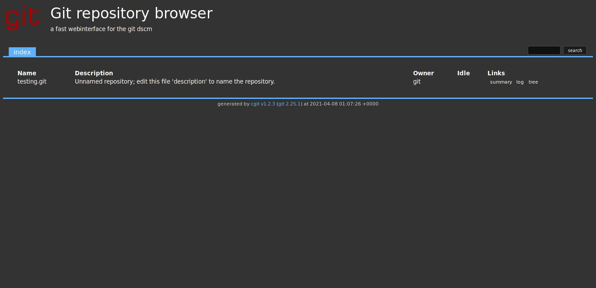

# gitolite-cgit based on alpine image

## What is this image?

[`rusian/gitolite-cgit`](https://hub.docker.com/r/rusian/gitolite-cgit) is a Docker image with `cgit` in dark-mode and `gitolite` running on top of `alpine` base image.



## Usage

1. Pull the image

```console
$ docker pull rusian/gitolite-cgit
```

2. Run the image with provided environment:

```console
$ docker run -e SSH_KEY="$(cat ~/.ssh/id_ed25519.pub)" -e SSH_KEY_NAME="$(whoami)" -p 22:22 -p 80:80 -p 9418:9418 -v repo:/var/lib/git/ rusian/gitolite-cgit
```

### Environment

- `SSH_KEY`: Public key of gitolite admin
- `SSH_KEY_NAME`: Name of gitolite admin
- `CGIT_CLONE_PREFIX`: cgit clone prefix to display on each repository. For example: `https://git.example.com`, the clone URL should be: `ssh://git@example.com`
- `CGIT_ROOT_TITLE`: Text printed as heading on the repository index page. Default value: "Git Repository Browser".
- `CGIT_DESC`: Add description to cgit
- `CGIT_SNAPSHOT`: Snapshot tarball.

### Exposed ports

- Port 22: for SSH clone
- Port 80: for cgit webpage running on Nginx
- Port 9418: for git daemon protocol

### Volume

- `/var/lib/git`: gitolite home folder, store all repositories like `gitolite-admin`
- `/etc/ssh/`: store all generated SSH server key

### How to interact with git server

Cgit webpage: `http://<server_ip>/`

Supported clone method:

- SSH: authentication with gitolite configuration inside `gitolite-admin`.
  For more information, please refer to [basic administration](https://gitolite.com/gitolite/basic-admin.html).
  Syntax: `git clone ssh://git@<server_ip>/<repo_name>`

- HTTP: `enable-http-clone=1` by default, which let cgit act as a dumb HTTP enpoint for git clones.
  You can disable that by edit /etc/cgitrc. I may consider to add more feature, so you can set config
  from `docker run` or `docker-compose.yml`. `git push` is not supported via HTTP at this moment.
  Syntax: `git clone http://<server_ip>/<repo_name>`

- GIT: `git daemon` is enabled by default with `upload-pack` service
  (this serves git fetch-pack and git ls-remote clients), allowing anonymous
  fetch, clone. Syntax: `git clone git://<server_ip>/<repo_path>`

## Docker-compose

1. Pull the image:

```console
$ docker pull rusian/gitolite-cgit
```

2. Create environment file

In this repo, I create `gitolite` admin with the host public key and username.
In case, you are running this on server, you need to enter
**SSH_KEY** and **SSH_KEY_NAME** into `config.env`:

```
#
# Gitolite options
#
SSH_KEY=<your public key content>
SSH_KEY_NAME=<your gitolite name>
#
# Cgit options
#
CGIT_ROOT_TITLE=Git Repository Browser
CGIT_DESC=a fast webinterface for the git dscm
CGIT_CLONE_PREFIX=http://<YOUR-DOMAIN> ssh://git@<YOUR-DOMAIN>

CGIT_SNAPSHOT=tar.gz tar.bz2 tar.xz
```

For convience, I create a `bootstrap.sh` script for user who use public
key and name from the host running Docker:

```bash
# change ssh_key, ssh_key_name to reflect your current setup
SSH_KEY=$(cat ~/.ssh/id_ed25519.pub)
SSH_KEY_NAME=$(whoami)

sed -i.bak \
    -e "s#SSH_KEY=.*#SSH_KEY=${SSH_KEY}#g" \
    -e "s#SSH_KEY_NAME=.*#SSH_KEY_NAME=${SSH_KEY_NAME}#g" \
    "$(dirname "$0")/config.env"
```

Generate public key and private key:

```console
sh bootstrap.sh
```

3. Create `docker-compose.yml`:

```yml
version: '3'

services:
  app:
    image: rusian/gitolite-cgit
    container_name: gitolite-cgit
    env_file: config.env
    volumes:
      - git:/var/lib/git/
    ports:
      - 22:22
      - 80:80
      - 9418:9418
    tty: true
volumes:
  git:
```
Then power-on your container:

```console
$ docker-compose up -d
```

### Customize cgit configuration

As there are many cgit configuration, you can create cgitrc configure and map to `/etc/cgitrc`

```bash
# Copy cgitrc from existing container
docker cp gitolite-cgit:/etc/cgitrc .
```

Modify the `docker-compose.yml`:

```yml
version: '3'

services:
  app:
    image: rusian/gitolite-cgit
    container_name: gitolite-cgit
    env_file: config.env
    volumes:
      - git:/var/lib/git/
      - ./cgitrc:/etc/cgitrc
    ports:
      - 22:22
      - 80:80
      - 9418:9418
    tty: true
volumes:
  git:
```

## Build docker image

```console
$ git clone https://c.hgit.ga/containers/gitolite-cgit-docker.git
```

```console
$ cd gitolite-cgit-docker/gitolite-cgit
```

```console
$ docker build --tag rusian/gitolite-cgit -f Dockerfile .
```

## Extra

Example of `gitolite-admin/conf/gitolite.conf`:

```conf
#-----------
#  General
#-----------
@secret         =  gitolite-admin
@hiddenrepo     =  gitolite-admin

#-----------
#  People
#-----------
@p-admin        =  paco
@p-team         =  minoru

#----------------------
#  Repositories
#----------------------
repo @hiddenrepo
     config cgit.ignore = 1

repo @secret
     - = cgit daemon
     option deny-rules = 1

repo @all
     R          =  cgit daemon

repo gitolite-admin
     RW+        =  @p-admin

repo science/numeral
     RW+                        =  @p-admin
     -   master develop         =  @p-team
     -   refs/tags/v[0-9]       =  @p-team
     RW+                        =  @p-team
     desc                       =  "Repo paco files"
     config gitweb.owner        =  paco

repo documents/operators
     RW+                        =  @p-admin
     -   master develop         =  @p-team
     -   refs/tags/v[0-9]       =  @p-team
     RW+                        =  @p-team
     desc                       =  "Repo minoru files"
     config gitweb.owner        =  minoru

#------------------------
# Personal repositories
#------------------------
repo CREATOR/[a-zA-Z0-9].*
     C                          =  @p-admin @p-team
     RW+                        =  CREATOR
     RW+                        =  @p-admin
     R                          =  @all
     config gitweb.owner        =  %GL_CREATOR
```
